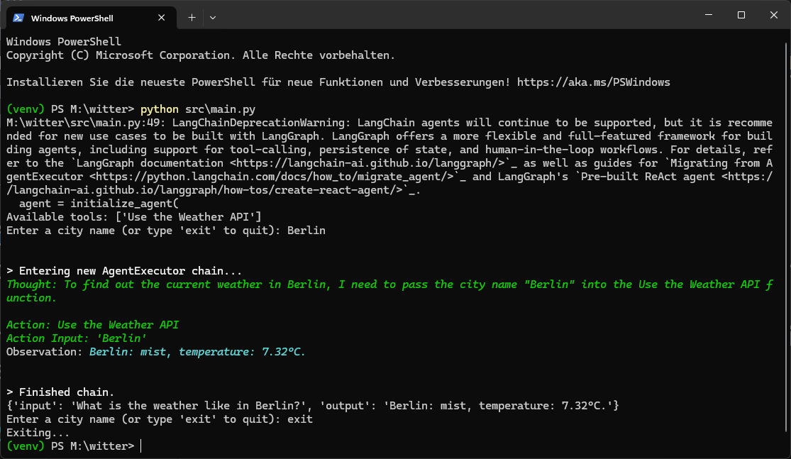

# tameronline-witter

## Overview

`tameronline-witter` is a structured and automated project setup designed to facilitate the management of Python-based development environments across multiple operating systems (Windows, Linux, and macOS). The project integrates virtual environment activation, dependency management, and testing automation.

## 🖼 Screenshots


## Features

- **Cross-Platform Compatibility**: Includes scripts for Windows (`.bat`, `.ps1`), Linux, and macOS (`.sh`).
- **Automated Environment Setup**: Detects Python installation, creates a virtual environment, and activates it.
- **Dependency Management**: Installs necessary Python packages from `requirements.txt`.
- **Testing Integration**: Contains test scripts to validate core functionalities.
- **GitHub Actions CI/CD**: Automated tests executed on push and pull requests.

## Installation

### Prerequisites

- **Python 3.6+**
- **Git** (for cloning the repository)
- **VS Code** (optional for enhanced development experience)

### Setup Instructions

#### **Cloning the Repository**

```bash
# Using HTTPS
git clone https://github.com/TamerOnLine/tameronline-witter.git

# Using SSH
git clone git@github.com:TamerOnLine/tameronline-witter.git
```

#### **Navigating to the Project Directory**

```bash
cd tameronline-witter
```

#### **Setting Up the Virtual Environment**

##### **Windows (Command Prompt)**

```cmd
activate_project.bat
```

##### **Windows (PowerShell)**

```powershell
.\activate_project.ps1
```

##### **Linux/macOS**

```bash
chmod +x activate_project.sh
./activate_project.sh
```

#### **Installing Dependencies**

```bash
pip install -r requirements.txt
```

## File Structure

```
tameronline-witter/
├── README.md                # Documentation
├── LICENSE                  # License file
├── activate_project.bat     # Windows CMD script
├── activate_project.ps1     # Windows PowerShell script
├── activate_project.sh      # Linux/macOS Bash script
├── requirements.txt         # Python dependencies
├── workspace.code-workspace # VS Code workspace configuration
├── img/                     # Image assets
│   ├── screenshot.png       # Screenshot of project structure
├── src/                     # Source code
│   ├── __init__.py
│   ├── main.py              # Main application logic
│   ├── runner.py            # Script runner
├── tests/                   # Test scripts
│   ├── __init__.py
│   ├── test.py
│   ├── test_key_witter.py   # API Key validation tests
│   ├── test_ollama.py       # LLM model test script
└── .github/workflows/       # CI/CD automation
    └── main.yml             # GitHub Actions workflow
```

## Usage

### **Running the Main Application**
To start the application and interact with the weather agent:
```bash
python src/main.py
```

### **Executing a Script via `runner.py`**

```bash
python src/runner.py
```

This will prompt you to select a script from the `src/` directory to execute.

### **Running Tests**

To run all test cases:

```bash
pytest tests/
```

## Troubleshooting

- **Python Not Found**: Ensure Python 3.6+ is installed and available in the system path.
- **Virtual Environment Activation Issues**: Delete the `venv` directory and rerun the activation script.
- **Permission Issues on macOS/Linux**: Run `chmod +x activate_project.sh` before executing the script.

## Contribution

Feel free to submit pull requests or report issues on the [GitHub repository](https://github.com/TamerOnLine/tameronline-witter).

## License

This project is licensed under the MIT License. See [LICENSE](LICENSE) for details.

## Additional Resources

For more details, visit the official repository: [GitHub Repository](https://github.com/TamerOnLine/tameronline-witter).

